# Jarkom-Modul-3-2025-K57

### Member
1. Prabaswara Febrian 5027241069
2. Erlinda Annisa Zahra 5027241108

### Laporan Resmi 

1. Dalam soal ini meminta untuk membangun kembali jaringan komunikasi antar kerajaan di awal Zaman Kedua setelah kehancuran Beleriand, di mana setiap node (kecuali Durin) harus dapat terhubung sementara ke Valinor/Internet melalui nameserver 192.168.122.1 untuk menerima instruksi awal.

didalam /root/.bashrc menambahkan

  echo "nameserver 192.168.122.1" > /etc/resolv.conf
  apt update && apt install iptables -y
  echo 1 > /proc/sys/net/ipv4/ip_forward
  iptables -t nat -A POSTROUTING -o eth0 -j MASQUERADE -s 10.92.0.0/16

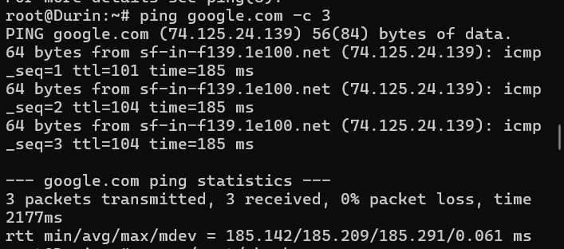

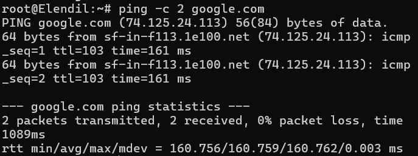

2. Soal ini meminta untuk mengatur pembagian alamat IP secara dinamis bagi client, di mana keluarga Manusia dan Peri mendapatkan rentang IP tertentu, sementara Khamul mendapat IP tetap di 10.92-.3.95, serta memastikan Durin dapat menyebarkan konfigurasi tersebut ke semua wilayah yang
terhubung dengannya.

Pertama harus install terlebih dahulu DHCP 

  apt update && apt install isc-dhcp-server -y

Lalu memberikan konfigurasi yang ada di file script. 
lalu bisa menjalankan di  Durin dengan 

  dhcrelay -d 10.92.4.2 eth1 eth2 eth3 eth4 eth5

lalu menjalankannya di khamul 

  ip addr flush dev eth0
  /tmp/gns3/bin/busybox udhcpc -i eth0 -v

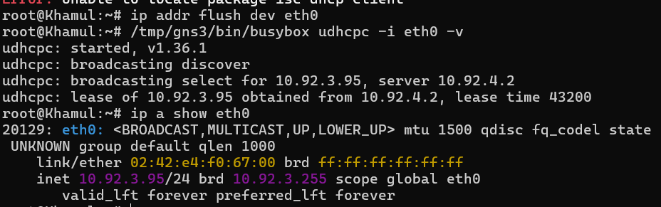

3. Soal ini meminta untuk mengatur agar seluruh node (kecuali Durin) hanya dapat mengakses atau mengirim data ke dunia luar (Valinor/Internet) melalui menara pengawas Minastir sebagai pengontrol dan pemeriksa arus informasi keluar.

Dalam minastir harus meng install bind9

  apt update && apt install bind9 -y
  ln -s /etc/init.d/named /etc/init.d/bind9

 Lalu memberikan konfigurasi seperti ada di script  

 lalu bisa menjalan kan di elendil 

   ping google.com -c 2
   
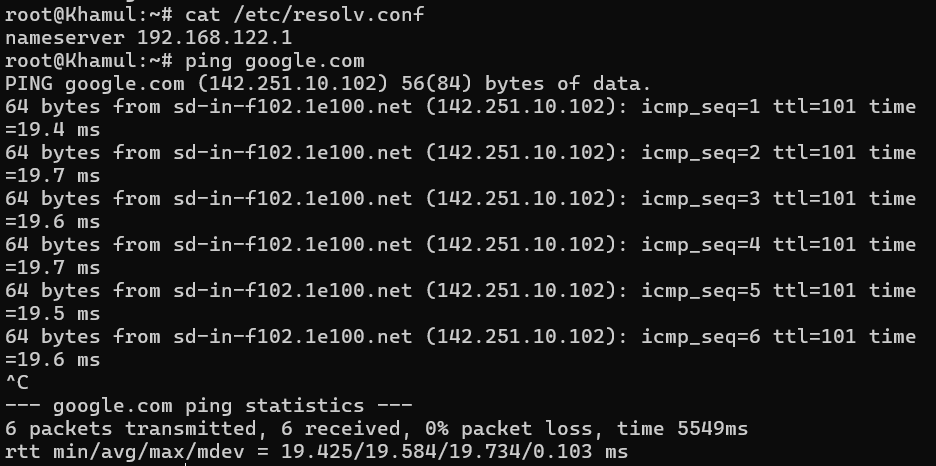

4. Soal ini meminta untuk membuat sistem penamaan domain (k57.com) dengan Erendis (ns1) sebagai master nameserver dan Amdir (ns2) sebagai slave yang menyalin datanya. Setiap lokasi penting diberi domain unik yang mengarah ke alamat fisik wilayah masing-masing.

Didalam Erendis bisa menginstall bind9

    apt update && apt install bind9 -y
    ln -s /etc/init.d/named /etc/init.d/bind9

lalu membuat folder 

  mkdir -p /etc/bind/k57

lalu membuat config 

  nano /etc/bind/named.conf.local

dengan isi: 

  zone "k57.com" {
      type master;
      file "/etc/bind/k57/k57.com";
      allow-transfer { 10.92.3.3; };   # IP Amdir
  };

dan membuat file 

  nano /etc/bind/k57/k57.com

dengan isi: 

    $TTL    604800
    @       IN      SOA     ns1.k57.com. root.k57.com. (
                            2025103101  ; Serial (YYYYMMDDNN)
                            604800      ; Refresh
                            86400       ; Retry
                            2419200     ; Expire
                            604800 )    ; Negative Cache TTL
    
    ; NS records
    @       IN      NS      ns1.k57.com.
    @       IN      NS      ns2.k57.com.
    
    ; A record for domain
    @       IN      A       10.92.3.2
    
    ; Nameservers
    ns1     IN      A       10.92.3.2
    ns2     IN      A       10.92.3.3
    
    ; Host records
    palantir    IN  A       10.92.4.3
    elros       IN  A       10.92.1.6
    pharazon    IN  A       10.92.2.3
    elendil     IN  A       10.92.1.4
    isildur     IN  A       10.92.1.3
    anarion     IN  A       10.92.1.5
    galadriel   IN  A       10.92.2.4
    celeborn    IN  A       10.92.2.5
    oropher     IN  A       10.92.2.6

Lakukan hal sama di amdir.

lalu lakukan testing dengan cara 

    # Erendis (ns1 master)
    dig @10.92.3.2 k57.com
    
    # Amdir (ns2 slave)
    dig @10.92.3.3 k57.com

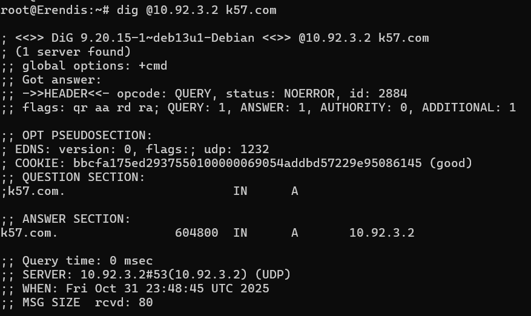

5. Soal ini meminta untuk menambahkan alias www k57.com untuk domain utama, membuat reverse PTR record agar lokasi Erendis dan Amdir dapat dilacak dari alamat IP-nya, serta menambahkan TXT record berisi pesan rahasia “Cincin Sauron” (mengarah ke Elros) dan “Aliansi Terakhir” (mengarah ke Pharazon), yang juga harus disalin oleh Amdir.
        
        # in erendis 
        
        # buat file konfigurasi zona
        nano /etc/bind/k57/k57.com
        # isinya
        ; Alias (CNAME)
        www     IN  CNAME   k57.com.
        
        ; TXT Records (pesan rahasia)
        elros       IN  TXT   "Cincin Sauron"
        pharazon    IN  TXT   "Aliansi Terakhir"
        
        # buat reverse zone file
        mkdir -p /etc/bind/k57
        nano /etc/bind/k57/3.92.10.in-addr.arpa
        # isinya
        $TTL 604800
        @       IN      SOA     ns1.k57.com. root.k57.com. (
                                2025110101  ; Serial
                                604800      ; Refresh
                                86400       ; Retry
                                2419200     ; Expire
                                604800 )    ; Negative Cache TTL
        
                IN      NS      ns1.k57.com.
                IN      NS      ns2.k57.com.
        
        2       IN      PTR     erendis.k57.com.
        3       IN      PTR     amdir.k57.com.
        
        # tambahkan reverse zone di named.conf.local
        nano /etc/bind/named.conf.local
        # tambah file zona
        zone "3.92.10.in-addr.arpa" {
            type master;
            file "/etc/bind/k57/3.92.10.in-addr.arpa";
            allow-transfer { 10.92.3.3; };
        };
        
        # cek dan restart bind9
        named-checkzone 3.92.10.in-addr.arpa /etc/bind/k57/3.92.10.in-addr.arpa
        service bind9 restart
        
        # in amdir (ns2 slave)
        # buat file
        nano /etc/bind/named.conf.local
        # tambah file zona
        zone "3.92.10.in-addr.arpa" {
            type slave;
            masters { 10.92.3.2; };
            file "/var/lib/bind/3.92.10.in-addr.arpa";
        };
        
        # restart bind9
        service bind9 restart
        
        # testing di elendil atau salah satu node
        
        # tes alias
        dig @10.92.3.2 www.k57.com
        
        # tes reverse
        dig @10.92.3.2 -x 10.92.3.2
        dig @10.92.3.2 -x 10.92.3.3
        
        # tes TXT record
        dig @10.92.3.2 elros.k57.com TXT
        dig @10.92.3.2 pharazon.k57.com TXT
   

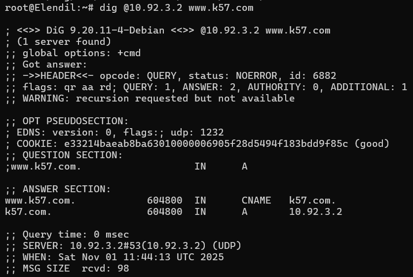

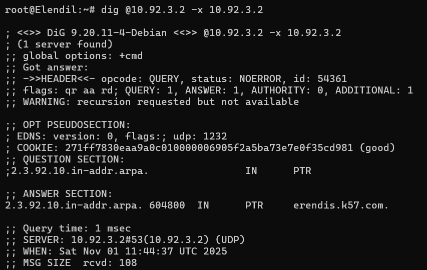

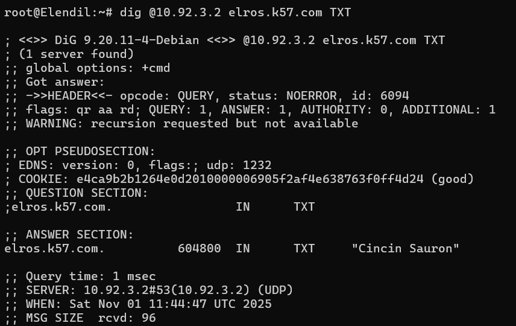

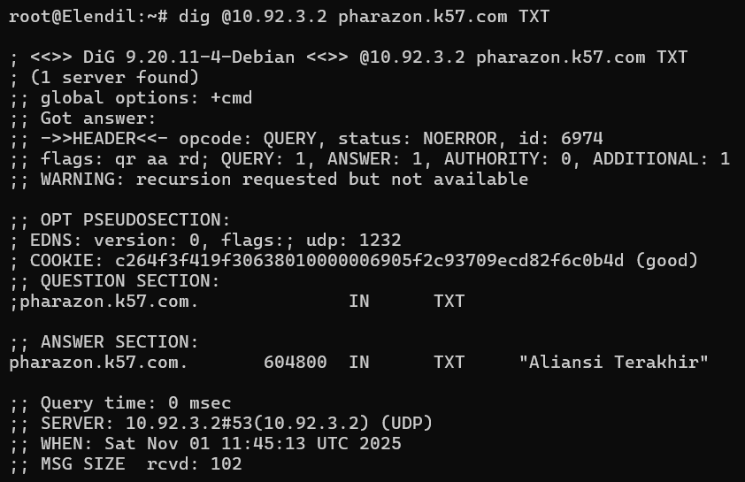

6. Soal ini meminta untuk mengatur lama waktu peminjaman IP dinamis, di mana keluarga Manusia mendapatkan lease time 30 menit, keluarga Peri 10 menit, dan batas maksimal peminjaman untuk semua client adalah 1 jam.

        # In Aldarion
        
        nano /etc/dhcp/dhcpd.conf
        
        # Ubah waktu lease pada masing-masing subnet
        # isinya
        
        authoritative;
        
        # Subnet Keluarga Manusia
        subnet 10.92.1.0 netmask 255.255.255.0 {
            range 10.92.1.6 10.92.1.34;
            range 10.92.1.68 10.92.1.94;
            option routers 10.92.1.1;
            option broadcast-address 10.92.1.255;
            option domain-name-servers 192.168.122.1;
            default-lease-time 1800;    # 30 menit
            max-lease-time 3600;        # 1 jam
        }
        
        # Subnet Keluarga Peri
        subnet 10.92.2.0 netmask 255.255.255.0 {
            range 10.92.2.35 10.92.2.67;
            range 10.92.2.96 10.92.2.121;
            option routers 10.92.2.1;
            option broadcast-address 10.92.2.255;
            option domain-name-servers 192.168.122.1;
            default-lease-time 600;     # 10 menit (1/6 jam)
            max-lease-time 3600;        # 1 jam
        }
        
        # Subnet Kurcaci (Khamul)
        subnet 10.92.3.0 netmask 255.255.255.0 {
            option routers 10.92.3.1;
            option broadcast-address 10.92.3.255;
            option domain-name-servers 192.168.122.1;
        }
        
        # Subnet Server (Aldarion)
        subnet 10.92.4.0 netmask 255.255.255.0 {
            range 10.92.4.10 10.92.4.50;
            option routers 10.92.4.1;
            option broadcast-address 10.92.4.255;
            option domain-name-servers 192.168.122.1;
        }
        
        # Fixed Address Khamul
        host Khamul {
            hardware ethernet 02:42:e4:f0:67:00;  # MAC address Khamul
            fixed-address 10.92.3.95;
        }
        
        # restart service
        service isc-dhcp-server restart
        # kalau direstart failed bisa coba ini
        dhcpd -t
        mkdir -p /var/lib/dhcp
        touch /var/lib/dhcp/dhcpd.leases
        rm -f /var/run/dhcpd.pid
        dhcpd -4 -d eth0
        
        # tes dari client amandil
        ip addr flush dev eth0
        /tmp/gns3/bin/busybox udhcpc -i eth0 -v

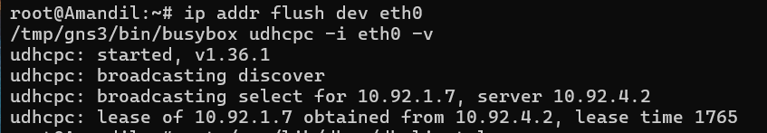

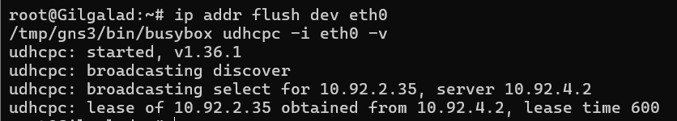

7. Soal ini meminta untuk menyiapkan lingkungan Laravel pada node para Ksatria Númenor (Elendil, Isildur, Anarion) dengan menginstal PHP 8.4, Composer, dan Nginx, kemudian mengambil resource Laravel di setiap node worker, serta melakukan pengecekan hasil instalasi menggunakan lynx dari sisi client.
        
           # Install di setiap node Laravel Worker (Elendil, Isildur, Anarion)
        
        # Update dan install dependensi dasar
        apt update && apt upgrade -y
        apt install -y git unzip curl ca-certificates lsb-release apt-transport-https nginx
        
        # Tambahkan repo PHP modern (Sury)
        apt install -y lsb-release ca-certificates apt-transport-https curl gnupg2
        curl -sSL https://packages.sury.org/php/README.txt | bash -x
        
        # Install PHP 8.4 dan ekstensi penting
        apt install -y php8.4 php8.4-cli php8.4-fpm php8.4-mbstring php8.4-xml php8.4-curl php8.4-zip php8.4-bcmath php8.4-intl php8.4-sqlite3
        php -v
        
        # Install Composer
        cd /tmp
        curl -sS https://getcomposer.org/installer -o composer-setup.php
        php composer-setup.php --install-dir=/usr/local/bin --filename=composer
        composer -V
        
        # Install Nginx
        apt install -y nginx
        systemctl enable nginx
        nginx -t
        ps aux | grep nginx
        
        # Buat proyek laravel baru
        cd /var/www
        composer create-project laravel/laravel laravel-app
        
        # Setel izin direktori
        chown -R www-data:www-data /var/www/laravel-app
        chmod -R 755 /var/www/laravel-app
        
        # Konfigurasi Nginx untuk Laravel
        nano /etc/nginx/sites-available/laravel
        
        # Isi dengan konfigurasi berikut:
        server {
            listen 80;
            server_name _;
        
            root /var/www/laravel-app/public;
            index index.php index.html;
        
            location / {
                try_files $uri $uri/ /index.php?$query_string;
            }
        
            location ~ \.php$ {
                include snippets/fastcgi-php.conf;
                fastcgi_pass unix:/run/php/php8.4-fpm.sock;
            }
        
            location ~ /\.ht {
                deny all;
            }
        }
        
        # Aktifkan dan restart
        ln -s /etc/nginx/sites-available/laravel /etc/nginx/sites-enabled/
        nginx -t
        nginx -s reload
        
        # Install Lynx
        apt update
        apt install -y lynx
        
        # Di Elros (Load Balancer), tes akses ke Laravel Worker
        apt update && apt install -y nginx
        service nginx start
        
        # Buat Resource Laravel di Load Balancer (Elros)
        cd /var/www/html
        echo "Laravel Resource Server - Elros" > index.html
        
        # Tes akses dari Elros ke Laravel di Worker (Elendil, Isildur, Anarion)
        lynx http://10.92.1.6

8. Soal ini meminta untuk mengatur koneksi database Palantir pada file .env di setiap worker Laravel, mengonfigurasi Nginx agar masing-masing benteng (Elendil, Isildur, Anarion) berjalan di port 8001, 8002, dan 8003, menjalankan migrasi serta seeding awal dari Elendil, serta membatasi akses web agar hanya dapat dilakukan melalui domain nama, bukan alamat IP.

      #ELENDIL
      
      nano /var/www/laravel-app/.env
      
      #Isi dengan:
      APP_NAME=elednil
      APP_ENV=local
      APP_KEY=base64:...
      APP_DEBUG=true
      APP_URL=http://elendil.numenor:8001
      
      DB_CONNECTION=sqlite
      DB_HOST=10.92.4.2
      DB_PORT=3306
      DB_DATABASE=elendil_db
      DB_USERNAME=elendil_user
      DB_PASSWORD=elendil_pass
      
      nano /etc/nginx/sites-available/elendil.numenor
      
      #Isi dengan:
      server {
          listen 8001;
          listen [::]:8001;
          server_name elendil.numenor;
      
          root /var/www/laravel-app/public;
          index index.php index.html index.htm;
      
          if ($host != "elendil.numenor") {
              return 444;
          }
      
          location / {
              try_files $uri $uri/ /index.php?$query_string;
          }
      
          location ~ \.php$ {
              include snippets/fastcgi-php.conf;
              fastcgi_pass unix:/var/run/php/php8.4-fpm.sock;
          }
      
          location ~ /\.ht {
              deny all;
          }
      }
      
      ln -s /etc/nginx/sites-available/elendil.numenor /etc/nginx/sites-enabled/
      nginx -t
      nginx -s reload
      
      cd /var/www/laravel-app
      php artisan migrate --seed
      
      nano /etc/hosts
      
      #Tambahkan:
      127.0.0.1    elendil.numenor
      
      #Tes
      curl http://elendil.numenor:8001
      
      
      #ISILDUR 
      nano /var/www/laravel-app/.env
      
      #Isi dengan:
      APP_NAME=isildur
      APP_ENV=local
      APP_KEY=base64:...
      APP_DEBUG=true
      APP_URL=http://isildur.numenor:8002
      
      DB_CONNECTION=sqlite
      DB_HOST=10.92.4.2
      DB_PORT=3306
      DB_DATABASE=isildur_db
      DB_USERNAME=isildur_user
      DB_PASSWORD=isildur_pass
      
      nano /etc/nginx/sites-available/elendil.numenor
      
      #Isi dengan:
      server {
          listen 8002;
          listen [::]:8002;
          server_name isildur.numenor;
      
          root /var/www/laravel-app/public;
          index index.php index.html index.htm;
      
          if ($host != "isildur.numenor") {
              return 444;
          }
      
          location / {
              try_files $uri $uri/ /index.php?$query_string;
          }
      
          location ~ \.php$ {
              include snippets/fastcgi-php.conf;
              fastcgi_pass unix:/var/run/php/php8.4-fpm.sock;
          }
      
          location ~ /\.ht {
              deny all;
          }
      }
      
      ln -s /etc/nginx/sites-available/isildur.numenor /etc/nginx/sites-enabled/
      nginx -t
      nginx -s reload
      
      nano /etc/hosts
      
      #Tambahkan:
      127.0.0.1 isildur.numenor
      
      #Tes
      curl http://elendil.numenor:8002
      
      #ANARION
      nano /var/www/laravel-app/.env
      
      #Isi dengan:
      PP_NAME=anarion
      APP_ENV=local
      APP_KEY=base64:...
      APP_DEBUG=true
      APP_URL=http://isildur.numenor:8003
      
      DB_CONNECTION=sqlite
      DB_HOST=10.92.4.2
      DB_PORT=3306
      DB_DATABASE=anrion_db
      DB_USERNAME=anarion_user
      DB_PASSWORD=anarion_pass
      
      nano /etc/nginx/sites-available/anarion.numenor
      
      #Isi dengan:
      server {
          listen 8003;
          listen [::]:8003;
          server_name anarion.numenor;
      
          root /var/www/laravel-app/public;
          index index.php index.html index.htm;
      
          if ($host != "anarion.numenor") {
              return 444;
          }
      
          location / {
              try_files $uri $uri/ /index.php?$query_string;
          }
      
          location ~ \.php$ {
              include snippets/fastcgi-php.conf;
              fastcgi_pass unix:/var/run/php/php8.4-fpm.sock;
          }
      
          location ~ /\.ht {
              deny all;
          }
      }
      
      ln -s /etc/nginx/sites-available/anarion.numenor /etc/nginx/sites-enabled/
      nginx -t
      nginx -s reload
      
      nano /etc/hosts
      
      #Tambahkan:
      127.0.0.1 anarion.numenor
      
      #Tes:
      curl http://anarion.numenor:8003
